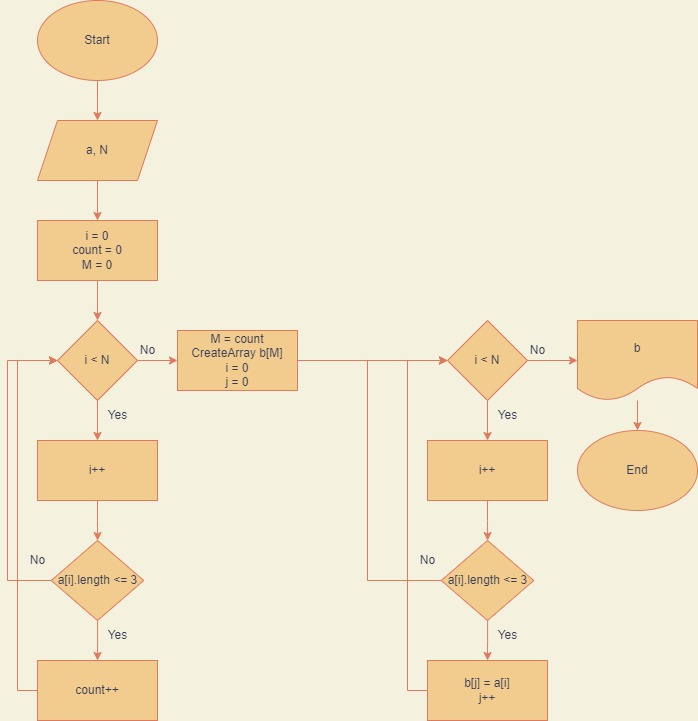

# Описание решения

**Задача**: *Написать программу, которая из имеющегося массива строк формирует новый массив из строк, длина которых меньше, либо равна 3 символам. Первоначальный массив можно ввести с клавиатуры, либо задать на старте выполнения алгоритма. При решении не рекомендуется пользоваться коллекциями, лучше обойтись исключительно массивами.*

## Ввод исходных данных

1. Ввод количества элементов массива.
2. Ввод элементов массива.

## Создание нового массива

1. Подсчёт подходящих под условие задачи элементов массива проходом циклом по исходному массиву.

2. Создание нового массива с нужным количеством элементов.

## Заполнение нового массива и вывод результата

Проход циклом по всем элементам исходного массива и заполнение подходящими под условие элементами нового массива с выводом их в консоль.

## Иллюстрация

Алгоритм решения представлен на диаграмме:

